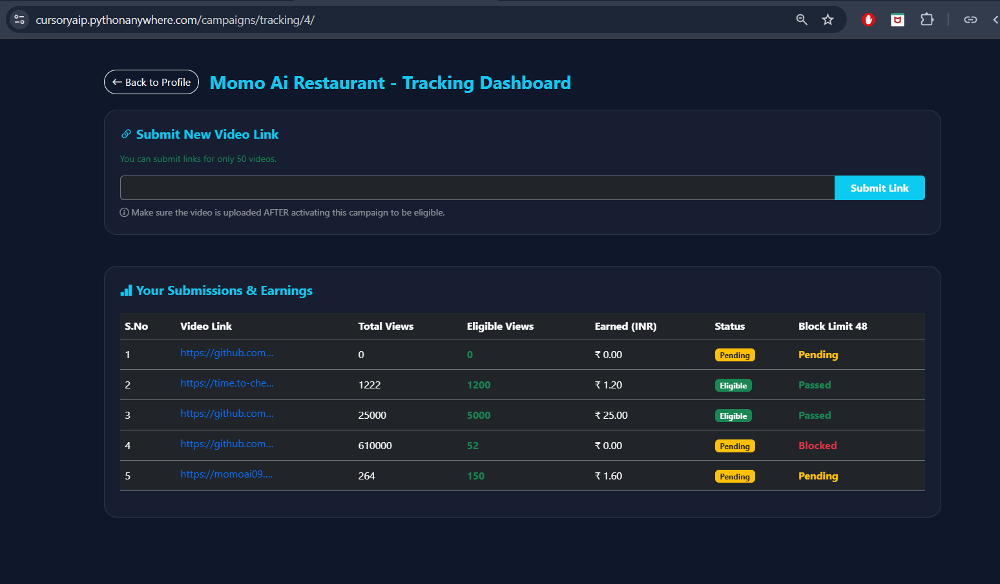
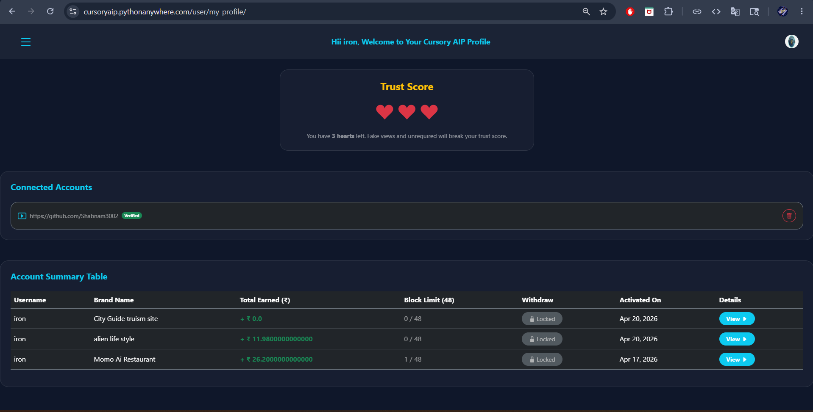
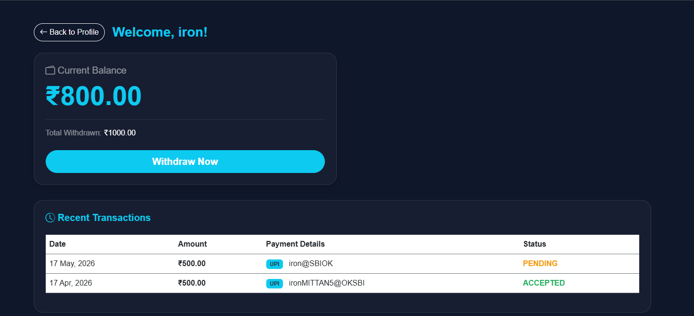

# Cursory AIP (All India Promotion Platform)

**Cursory AIP** is a secure, automated peer-to-peer web platform built to connect brands with 
genuine social media creators. It eliminates bot-fraud for brands and ensures transparent, direct INR payouts for creators based strictly on authentic engagement. 

## Cursory AIP vs Global Alternatives 
unlike global platform that rely on complex payment gateways and lack strict local fraud monitoring, Cursory AIP is built specifically for high-volume Indian creator economy.

---

| Feature | Cursory AIP | USD Global Platforms |
| :--- | :--- | :--- |
| **Currency & Volume** | **INR** (High local volume, consistent deals) | USD (Rare international deals) |
| **Payment Gateway** | **Direct UPI / Bank Transfer** (Instant) | PayPal (Heavy conversion fees) |
| **Bot Protection** | **3-Hearts Anti-Fraud Guard** (Bans at 48 failed links) | Minimal to None |
| **Account Linking** | **Automated Bio-Code** (No passwords required) | Risky password sharing |
---
## ⚙️ Core Architecture & Pipeline
The platform operates on a 4-tier automated system:

| Stage | Process | Analogy |
| :-- | :-- | :-- |
| **1. Verification** | Selenium headless browser verifies 5-minute Bio-code | security guard |
| **2. Submission** | backend URL cleaning & duplicate link tracking | Data Entry |
| **3. Trust score** | monitors invalid views & bans users exceeding 48 blocks | the judge |
| **4. Wallet system** | filters 'Eligible views' into INR (₹500 Threshold) | bank teller |

---
## ✨ key Technical Features

### 1. Automated Bio-code verification ('earning_profile')
To ensure maximum security and eliminate identity theft:
* generates a unique, 5-minutes valid **Bio-code**.
* uses a custom-built selenium scraper ('undetected-chromodriver') to visit creator's profile, pause for human-like behavior, and verify the code directly from the bio.

### 💖 2. Fraud guard & trust score system ('fraud_guard')
A zero-tolerance anti-fraud algorithm protecting brands from bot traffic.
* Every creator starts with **3 trust hearts**.
* if a creator submits 48 blocked/invalid links in a single campaigns, the lose a heart.
* losing all 3 hearts results in a permanent account deactivation.

### 💰 3. Automated Tracking & INR Wallet ('payments')
* **Real-time Tracking;** Separates 'total views' from 'eligible views'.
* **Smart Withdrawals:** Built-in wallet a minimum threshold of ₹500 and an automated 3% platform fee deduction mechanism.

---

## ⚖️ Legal & Proprietary Notice
**This is a proprietary business model.**
The algorithms, automation logic, and UI design are the intellectual property of Cursory AIP. The platform strictly enforces the Indian IT Act (Section 66D) and BNS againt bot traffic, identity theft, and cheating.

*(Please refer to the 'SECURITY.md' file for full legal and compliance policies).*

---

## Platform Interface & UI

### 1. The Tracking Dashboard (Brand Safety)
Here, the backend separated 'total views' from verified 'Eligible views', filtering out any bot traffic to calculate actual INR earnings.

### 2. Creator Profile & Trust Score
A strict 3-hearts trust system. Repeated invalid/fake link submission lead to a permanent account ban.

### 3. Smart Wallet & Automated Fees
Direct UPI/Bank transfers with a minimum threshold of ₹500 and automated 3% platform fee logic.

---

**@ 2026 Cursory AIP. All rights reserved.**

